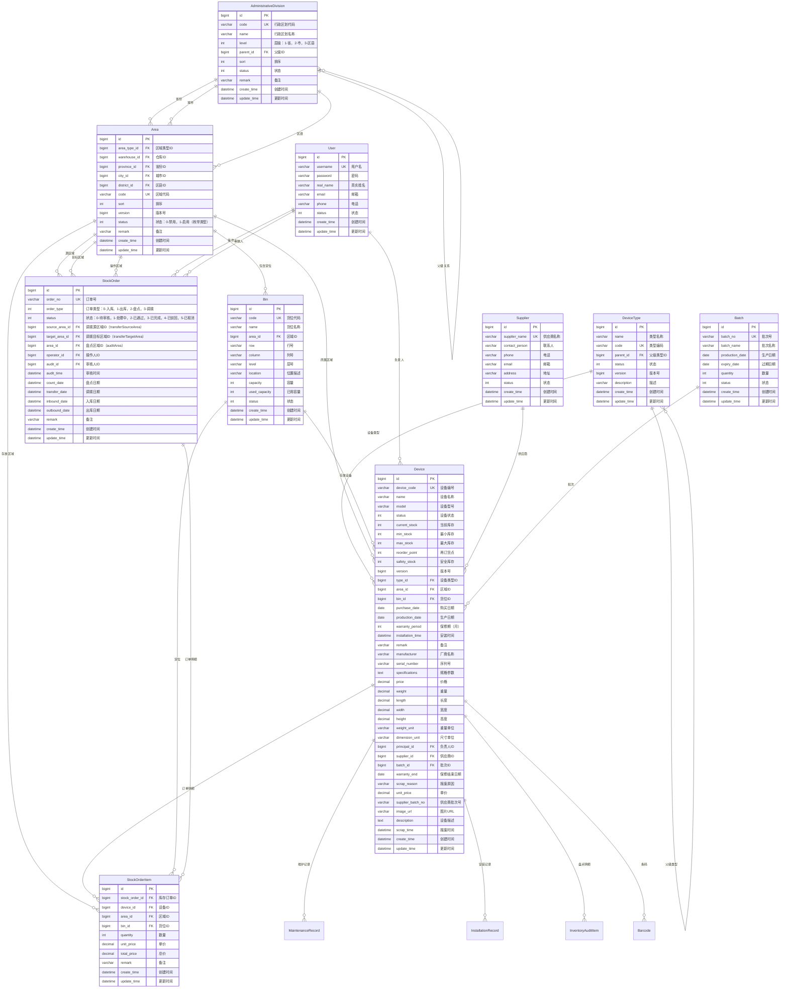

# 仓库管理系统实体关系图

## 实体关系图（ERD）



## 核心实体说明

### 1. AdministrativeDivision（行政区划）
- **作用**：管理省、市、区县三级行政区划
- **层级关系**：通过parent_id实现自关联，支持多级嵌套
- **关联关系**：
  - 与Area：一对多（一个行政区划对应多个区域）

### 2. Area（区域）
- **作用**：管理仓库的区域划分，支持省市区三级结构
- **字段特点**：
  - 关联字段：province_id、city_id、district_id（关联AdministrativeDivision）
  - 状态字段：status使用枚举类型（AreaStatus：0-禁用，1-启用）
- **关联关系**：
  - 与AdministrativeDivision：多对一（区域属于行政区划）
  - 与Device：一对多（一个区域包含多个设备）
  - 与Bin：一对多（一个区域包含多个货位）

### 3. DeviceType（设备类型）
- **作用**：管理设备类型，支持层级分类
- **层级关系**：通过parent_id实现自关联，支持父子类型
- **关联关系**：
  - 与Device：一对多（一个类型对应多个设备）

### 4. Device（设备）
- **作用**：核心实体，管理设备信息
- **关键字段**：
  - device_code：设备编号（唯一）
  - type_id：设备类型ID
  - area_id：区域ID
  - bin_id：货位ID
  - status：设备状态
  - current_stock：当前库存
- **关联关系**：
  - 与DeviceType：多对一（设备属于某个类型）
  - 与Area：多对一（设备属于某个区域）
  - 与Bin：多对一（设备存放在某个货位）

### 5. StockOrder（库存订单）
- **作用**：管理入库、出库、盘点、调拨等库存操作
- **订单类型**：
  - 0：入库
  - 1：出库
  - 2：盘点
  - 3：调拨
- **关联关系**：
  - 与StockOrderItem：一对多（一个订单包含多个明细）
  - 与Area：多对一（订单关联区域）

### 6. StockOrderItem（库存订单明细）
- **作用**：记录库存订单的设备明细
- **关联关系**：
  - 与StockOrder：多对一（明细属于某个订单）
  - 与Device：多对一（明细关联某个设备）
  - 与Area：多对一（明细关联存放区域）
  - 与Bin：多对一（明细关联存放货位）

## 数据流转关系

### 入库流程
```
StockOrder (order_type=0) 
  → StockOrderItem 
    → Device (current_stock增加)
    → Area (设备存放区域)
    → Bin (设备存放货位)
```

### 出库流程
```
StockOrder (order_type=1) 
  → StockOrderItem 
    → Device (current_stock减少)
    → Area (设备来源区域)
    → Bin (设备来源货位)
```

### 盘点流程
```
StockOrder (order_type=2) 
  → StockOrderItem 
    → Device (库存核对)
    → Area (盘点区域)
```

### 调拨流程
```
StockOrder (order_type=3) 
  → StockOrderItem 
    → Device (current_stock不变，位置变更)
    → Area (source_area_id → target_area_id)
    → Bin (货位变更)
```

## 索引优化建议

### 高频查询索引
1. **Device表**：
   - idx_device_code（设备编号）
   - idx_device_area_bin_status（区域+货位+状态）
   - idx_device_type_status（类型+状态）

2. **Area表**：
   - idx_area_city_district（城市+区县）
   - idx_area_status_sort（状态+排序）

3. **StockOrder表**：
   - idx_order_no（订单号）
   - idx_order_type_status（类型+状态）
   - idx_create_time（创建时间）

4. **StockOrderItem表**：
   - idx_stock_order_id（订单ID）
   - idx_device_id（设备ID）
   - idx_area_id（区域ID）

### 复合索引策略
- 遵循最左前缀原则
- 高选择性字段放在前面
- 考虑查询的WHERE、ORDER BY、JOIN条件
