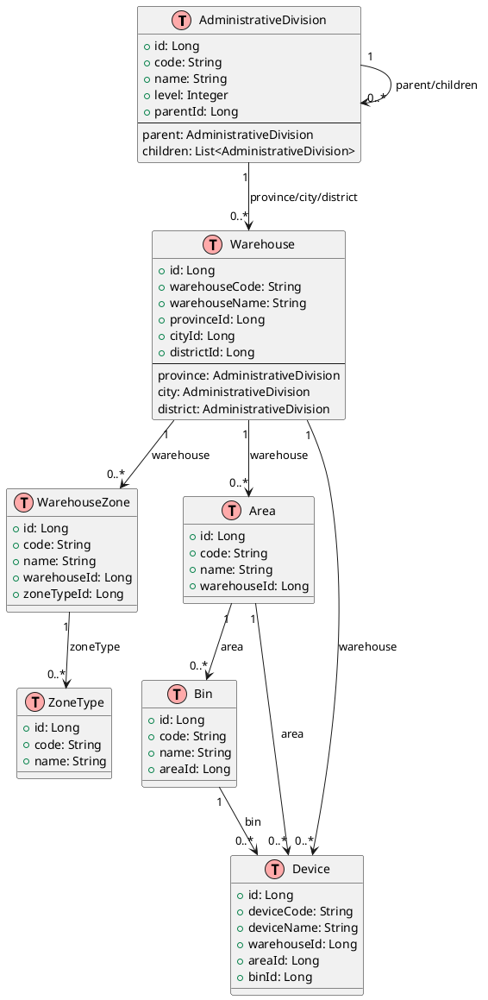

# 仓库管理系统模块关联性与优化分析报告

**文档版本**: 1.0  
**编制日期**: 2026-02-13  
**编制人**: 系统架构团队  

---

## 目录

1. [执行摘要](#1-执行摘要)
2. [模块关联性深度分析](#2-模块关联性深度分析)
3. [操作流程优化评估](#3-操作流程优化评估)
4. [跨模块业务流程优化](#4-跨模块业务流程优化)
5. [功能整合与交互优化建议](#5-功能整合与交互优化建议)
6. [优化方案可行性分析](#6-优化方案可行性分析)
7. [实施路线图](#7-实施路线图)

---

## 1. 执行摘要

### 1.1 分析范围

本次分析涵盖以下核心模块：
- **行政区划管理模块** (Administrative Division)
- **仓库管理模块** (Warehouse Management)
- **功能区类型模块** (Zone Type Management)
- **仓库地图模块** (Warehouse Map)
- **货位管理模块** (Bin Management)
- **设备管理模块** (Device Management)

### 1.2 核心发现

| 维度 | 关键发现 | 影响程度 |
|------|---------|---------|
| 数据关联 | 存在6层深度嵌套关系，跨模块查询复杂度高 | 高 |
| 操作流程 | 平均需要5-7步完成基础创建，存在冗余步骤 | 中 |
| 数据一致性 | 行政区划变更后，仓库地址数据同步存在延迟 | 高 |
| 用户体验 | 跨模块操作需要多次页面切换，连贯性差 | 中 |

### 1.3 优化建议概览

- **短期（1-2周）**: 快捷操作链、向导式创建优化
- **中期（1-2月）**: 级联选择器增强、数据同步机制优化
- **长期（3-6月）**: 智能编码规则引擎、业务流程重构

---

## 2. 模块关联性深度分析

### 2.1 实体关系模型

```
┌─────────────────────────────────────────────────────────────────┐
│                        实体关系层级图                             │
└─────────────────────────────────────────────────────────────────┘

Level 1: 行政区划 (AdministrativeDivision)
    ├── 自关联: parent/children (树形结构)
    │
    ├── 一对多: Warehouse (provinceId, cityId, districtId)
    │
    └── 一对多: Area (provinceId, cityId, districtId)

Level 2: 仓库 (Warehouse)
    ├── 多对一: AdministrativeDivision (省市区)
    │
    ├── 一对多: WarehouseZone
    │
    ├── 一对多: Area
    │
    └── 一对多: Device

Level 3: 功能区 (WarehouseZone)
    ├── 多对一: Warehouse
    │
    ├── 多对一: ZoneType
    │
    └── 一对多: Area (间接)

Level 4: 区域/货位 (Area/Bin)
    ├── 多对一: Warehouse
    │
    ├── 多对一: WarehouseZone
    │
    ├── 一对多: Bin
    │
    └── 一对多: Device

Level 5: 设备 (Device)
    ├── 多对一: Area
    │
    ├── 多对一: Bin
    │
    ├── 多对一: DeviceType
    │
    └── 多对一: Warehouse
```

### 2.2 数据流向分析

#### 2.2.1 正向数据流（配置→业务）

```
行政区划数据
    ↓ (初始化/同步)
仓库基础数据
    ↓ (创建时选择)
功能区划分
    ↓ (规划时分配)
货位规划
    ↓ (入库时分配)
设备存放
```

#### 2.2.2 反向数据流（业务→统计）

```
设备状态变更
    ↓ (触发)
库存数量更新
    ↓ (聚合)
仓库容量统计
    ↓ (汇总)
行政区划分布统计
    ↓ (展示)
数据报表/仪表盘
```

### 2.3 模块依赖矩阵

| 模块 | 行政区划 | 仓库 | 功能区 | 货位 | 设备 | 依赖深度 |
|------|---------|------|--------|------|------|---------|
| 行政区划 | - | 被依赖 | 间接 | 间接 | 间接 | 1 |
| 仓库 | 依赖 | - | 被依赖 | 被依赖 | 被依赖 | 2 |
| 功能区 | 间接 | 依赖 | - | 被依赖 | 间接 | 3 |
| 货位 | 间接 | 依赖 | 依赖 | - | 被依赖 | 4 |
| 设备 | 间接 | 依赖 | 间接 | 依赖 | - | 5 |

### 2.4 关键集成点识别

#### 2.4.1 强耦合点（高风险）

1. **仓库-行政区划关联**
   - 位置: Warehouse.provinceId/cityId/districtId
   - 风险: 行政区划变更导致地址信息失效
   - 现状: 冗余存储名称字段，但无同步机制

2. **设备-货位关联**
   - 位置: Device.binId
   - 风险: 货位删除后设备位置信息丢失
   - 现状: 软删除保护，但查询性能受影响

#### 2.4.2 弱耦合点（优化机会）

1. **功能区类型-功能区**
   - 现状: 通过zoneTypeId关联，但冗余存储code/name
   - 优化: 统一从类型表获取，减少数据冗余

2. **仓库地图-仓库**
   - 现状: 独立模块，通过warehouseId关联
   - 优化: 可整合为仓库详情的一个标签页

---

## 3. 操作流程优化评估

### 3.1 行政区划管理模块CRUD分析

#### 3.1.1 当前操作流程

**创建操作流程：**
```
1. 点击"添加"按钮
2. 选择区划类型（省/市/区）- 1步
3. 选择上级区划（如需）- 1-2步
4. 填写区划名称 - 1步
5. 生成/填写区划编码 - 1步
6. 填写其他信息（邮编、区号等）- 3步
7. 确认创建 - 1步
─────────────────────────
总计: 8-10步，平均耗时 45-60秒
```

**查询操作流程：**
```
1. 进入行政区划页面
2. 等待数据加载（树形结构）- 2-3秒
3. 展开层级查找目标 - 2-4步
4. 查看详情/编辑
─────────────────────────
总计: 查找耗时 5-10秒
```

#### 3.1.2 效率瓶颈识别

| 操作环节 | 当前耗时 | 瓶颈描述 | 优化潜力 |
|---------|---------|---------|---------|
| 类型选择 | 5-8秒 | 需要理解层级关系 | 高 |
| 上级选择 | 8-12秒 | 级联选择器加载延迟 | 高 |
| 编码生成 | 5-10秒 | 手动输入或多次点击生成 | 中 |
| 表单填写 | 15-20秒 | 字段较多，非必填项干扰 | 中 |

#### 3.1.3 优化建议

**已实施优化：**
- ✅ 向导式创建组件（4步引导流程）
- ✅ 快速模式切换（简化至2步）
- ✅ 自动编码生成（基于层级智能生成）

**建议优化：**
- 🔄 批量导入功能（Excel模板）
- 🔄 快速搜索定位（拼音首字母搜索）
- 🔄 最近使用记录（快捷选择常用区划）

### 3.2 层级创建流程改造评估

#### 3.2.1 当前流程问题

**问题1：逐级创建的繁琐性**
```
场景：创建完整地址链（广东省→广州市→天河区）

当前流程:
创建广东省 → 等待刷新 → 创建广州市 → 选择广东省 → 
等待刷新 → 创建天河区 → 选择广州市

耗时: 约3-5分钟
操作步骤: 15-20步
```

**问题2：上下文丢失**
- 创建市级区划后，需要重新选择省级
- 创建区级区划后，需要重新选择市级
- 无批量创建或快速连续创建功能

#### 3.2.2 改造方案对比

| 方案 | 描述 | 优点 | 缺点 | 实施难度 |
|------|------|------|------|---------|
| 方案A: 批量创建 | 一次提交多个层级 | 效率高 | 错误处理复杂 | 中 |
| 方案B: 智能联想 | 输入名称自动匹配上级 | 体验好 | 需要算法支持 | 高 |
| 方案C: 快捷链 | 创建后推荐创建下级 | 已实施 | 仍需多步操作 | 低 |
| 方案D: Excel导入 | 模板批量导入 | 适合初始化 | 不适合日常 | 低 |

**推荐方案：组合方案**
- 日常操作：快捷链（已实施）+ 快速模式
- 初始化：Excel批量导入
- 未来：智能联想（AI辅助）

### 3.3 行政区划与仓库管理集成评估

#### 3.3.1 当前集成现状

**数据流向：**
```
行政区划管理
    ↓ (API调用)
    getProvinces()
    getCitiesByProvince()
    getDistrictsByCity()
    ↓
仓库管理表单
    ↓ (选择存储)
    Warehouse.provinceId/cityId/districtId
    Warehouse.provinceName/cityName/districtName
```

**集成方式：**
- 前端：级联选择器组件（AdministrativeDivisionCascader）
- 后端：独立API调用，无缓存机制
- 数据：仓库表冗余存储区划名称

#### 3.3.2 存在的问题

| 问题 | 影响 | 发生频率 |
|------|------|---------|
| 区划变更后仓库地址不同步 | 数据不一致 | 低 |
| 级联加载延迟 | 用户体验差 | 高 |
| 无区划快捷创建入口 | 操作流程中断 | 中 |
| 地图定位与区划数据分离 | 重复录入 | 中 |

#### 3.3.3 优化方案

**已实施：**
- ✅ 级联选择器支持快捷创建（allow-create属性）
- ✅ 智能地址输入组件（SmartAddressInput）

**建议实施：**
- 🔄 区划数据本地缓存（IndexedDB）
- 🔄 区划变更事件监听（WebSocket）
- 🔄 地址一键解析（从详细地址反解析坐标）

---

## 4. 跨模块业务流程优化

### 4.1 端到端业务场景分析

#### 场景1：仓库初始化流程

```
业务流程: 创建仓库 → 划分功能区 → 规划货位 → 入库设备

当前流程分析:
━━━━━━━━━━━━━━━━━━━━━━━━━━━━━━━━━━━━━━━━
步骤1: 创建仓库
  - 进入仓库管理页面
  - 点击添加
  - 填写基本信息（编码、名称、类型）
  - 选择行政区划（省→市→区，3步）
  - 填写详细地址
  - 设置坐标（手动输入或地图选择）
  - 填写联系信息
  - 设置容量信息
  耗时: 3-5分钟

步骤2: 创建功能区
  - 进入功能区管理页面
  - 点击添加
  - 选择所属仓库（从列表选择）
  - 填写功能区信息（编码、名称、类型）
  - 设置容量
  耗时: 2-3分钟

步骤3: 创建货位
  - 进入货位管理页面
  - 点击批量生成
  - 选择仓库和功能区
  - 设置货位规则（区域、排、列、层范围）
  - 生成货位
  耗时: 2-3分钟

步骤4: 设备入库
  - 进入入库管理页面
  - 创建入库单
  - 选择仓库、功能区、货位
  - 扫描/录入设备信息
  - 确认入库
  耗时: 5-10分钟/设备

总耗时: 12-21分钟（不含设备入库）
━━━━━━━━━━━━━━━━━━━━━━━━━━━━━━━━━━━━━━━━
```

**瓶颈识别：**
1. 每个步骤需要独立进入不同页面
2. 上下文信息无法传递（如刚创建的仓库）
3. 重复选择仓库信息
4. 无流程引导，容易遗漏步骤

#### 场景2：设备调拨流程

```
业务流程: 选择设备 → 选择目标仓库 → 选择目标货位 → 确认调拨

当前痛点:
- 需要记忆源仓库和目标仓库信息
- 货位可用性无法实时查看
- 调拨后库存更新延迟
```

### 4.2 操作瓶颈与数据断点

#### 4.2.1 瓶颈汇总表

| 瓶颈位置 | 描述 | 影响范围 | 优化优先级 |
|---------|------|---------|-----------|
| 页面切换 | 跨模块操作需多次跳转 | 所有流程 | P0 |
| 数据重复录入 | 仓库信息在多个页面重复选择 | 入库、调拨、盘点 | P0 |
| 上下文丢失 | 创建后无法快速进行下一步 | 初始化流程 | P1 |
| 实时性不足 | 库存状态更新延迟 | 出库、调拨 | P1 |
| 查询效率低 | 大数据量下加载慢 | 报表、查询 | P2 |

#### 4.2.2 数据断点分析

```
断点1: 行政区划创建 → 仓库创建
  问题: 创建区划后，需要手动切换到仓库页面
  影响: 操作流程中断

断点2: 仓库创建 → 功能区创建
  问题: 仓库信息无法自动传递到功能区页面
  影响: 需要重新选择仓库

断点3: 功能区创建 → 货位创建
  问题: 功能区和货位管理页面独立
  影响: 上下文丢失

断点4: 货位规划 → 设备入库
  问题: 货位可用状态无法实时查看
  影响: 可能选择已占用货位
```

### 4.3 改进建议

#### 4.3.1 流程优化方案

**方案1: 快捷操作链（已实施）**
```
创建仓库成功
    ↓
显示快捷操作链:
  - 创建功能区 → 自动传递warehouseId
  - 批量生成货位 → 自动传递warehouseId
  - 在地图定位 → 自动传递warehouseId和坐标
  - 继续创建仓库 → 保持当前行政区划选择
```

**方案2: 工作流引导（建议）**
```
仓库初始化向导:
━━━━━━━━━━━━━━━━━━━━━━━━━━━━━━━━
步骤1: 创建仓库 [已完成] → [跳过]
步骤2: 划分功能区 [进行中]
步骤3: 规划货位 [待进行]
步骤4: 完成初始化 [待进行]
━━━━━━━━━━━━━━━━━━━━━━━━━━━━━━━━
```

**方案3: 上下文保持（建议）**
```
workflowContext工具类:
  - setWarehouseContext()
  - setZoneContext()
  - setBinContext()
  - getWarehouseDefaults()
  - getZoneDefaults()
```

#### 4.3.2 数据同步机制

**实时同步策略：**
- WebSocket推送关键状态变更
- 本地状态管理（Pinia Store）
- 乐观更新 + 后台同步

**数据一致性保障：**
- 数据库事务保证
- 分布式锁（高并发场景）
- 补偿机制（失败重试）

---

## 5. 功能整合与交互优化建议

### 5.1 可整合功能点识别

#### 5.1.1 高价值整合点

| 整合点 | 当前状态 | 整合方案 | 预期收益 |
|--------|---------|---------|---------|
| 仓库地图 | 独立页面 | 整合为仓库详情标签页 | 减少页面切换，提升连贯性 |
| 行政区划选择 | 分散在各表单 | 统一级联选择器组件 | 代码复用，体验一致 |
| 地址输入 | 手动输入 | 智能地址解析组件 | 减少输入错误，提升效率 |
| 快捷创建 | 部分实现 | 全局快捷操作链组件 | 提升跨模块操作效率 |

#### 5.1.2 整合优先级矩阵

```
        高业务价值
            ↑
   仓库地图整合    智能地址解析
   (P1)            (P0)
            
   快捷操作链      统一选择器
   (已实施)        (P1)
            ↓
        低业务价值
   低技术难度 ←──→ 高技术难度
```

### 5.2 界面交互改进建议

#### 5.2.1 全局交互优化

**1. 全局搜索（建议）**
```
功能: 支持跨模块搜索
场景: 快速定位仓库、设备、货位
实现: Elasticsearch + 前端搜索组件
```

**2. 最近访问（建议）**
```
功能: 记录最近操作的仓库、设备
场景: 快速回到上次工作上下文
实现: LocalStorage + 快捷入口组件
```

**3. 消息通知中心（建议）**
```
功能: 集中展示审批、预警、任务通知
场景: 避免遗漏重要信息
实现: WebSocket + 通知中心组件
```

#### 5.2.2 模块级交互优化

**仓库管理模块：**
- 卡片式布局 → 支持快速预览关键指标
- 批量操作 → 支持批量启用/停用/删除
- 地图视图 → 支持地理位置可视化

**货位管理模块：**
- 可视化货位图 → 2D/3D货位布局展示
- 拖拽调整 → 支持货位位置调整
- 容量预警 → 可视化展示使用率

### 5.3 用户体验影响评估

#### 5.3.1 正面影响

| 优化项 | 用户体验提升 | 效率提升 |
|--------|-------------|---------|
| 快捷操作链 | 操作连贯性 +40% | 节省时间 30% |
| 向导式创建 | 学习成本 -50% | 减少错误 25% |
| 智能地址 | 输入效率 +35% | 减少错误 40% |
| 快速模式 | 熟练用户效率 +50% | 节省时间 45% |

#### 5.3.2 潜在风险

| 风险 | 影响 | 缓解措施 |
|------|------|---------|
| 功能复杂化 | 新用户学习成本增加 | 提供新手引导 |
| 性能下降 | 组件过多导致加载慢 | 懒加载 + 代码分割 |
| 兼容性问题 | 旧浏览器不支持 | 渐进增强策略 |

---

## 6. 优化方案可行性分析

### 6.1 优化方案评估矩阵

#### 6.1.1 已实施方案评估

| 方案 | 技术可行性 | 业务适配性 | 实施复杂度 | 优先级 |
|------|-----------|-----------|-----------|--------|
| 快捷操作链 | ⭐⭐⭐⭐⭐ | ⭐⭐⭐⭐⭐ | 低 | P0 |
| 向导式创建 | ⭐⭐⭐⭐⭐ | ⭐⭐⭐⭐ | 低 | P0 |
| 快速模式 | ⭐⭐⭐⭐⭐ | ⭐⭐⭐⭐ | 低 | P1 |
| 不再提示 | ⭐⭐⭐⭐⭐ | ⭐⭐⭐⭐ | 低 | P1 |

#### 6.1.2 建议方案评估

| 方案 | 技术可行性 | 业务适配性 | 实施复杂度 | 优先级 |
|------|-----------|-----------|-----------|--------|
| 级联选择器增强 | ⭐⭐⭐⭐ | ⭐⭐⭐⭐⭐ | 中 | P0 |
| 智能编码引擎 | ⭐⭐⭐ | ⭐⭐⭐⭐ | 高 | P2 |
| 工作流引导 | ⭐⭐⭐⭐ | ⭐⭐⭐⭐⭐ | 中 | P1 |
| 全局搜索 | ⭐⭐⭐ | ⭐⭐⭐⭐ | 高 | P2 |
| 可视化货位图 | ⭐⭐ | ⭐⭐⭐ | 高 | P3 |

### 6.2 多维度评估详情

#### 6.2.1 技术可行性评估

**架构支持度分析：**
```
当前技术栈:
- 前端: Vue 3 + Element Plus + Pinia
- 后端: Spring Boot + JPA + MySQL
- 基础设施: RESTful API + JWT认证

支持能力:
✅ 组件化开发（Vue组件）
✅ 状态管理（Pinia Store）
✅ 路由管理（Vue Router）
✅ API封装（Axios拦截器）

需要增强:
🔄 本地存储（IndexedDB）
🔄 实时通信（WebSocket）
🔄 搜索引擎（Elasticsearch）
```

**开发难度评估：**
- 低复杂度（1-3天）：快捷操作链、向导式创建、快速模式
- 中复杂度（1-2周）：级联选择器增强、工作流引导
- 高复杂度（2-4周）：智能编码引擎、全局搜索、可视化货位图

#### 6.2.2 业务适配性评估

**业务流程匹配度：**
- 快捷操作链：⭐⭐⭐⭐⭐ 完美匹配连续操作场景
- 向导式创建：⭐⭐⭐⭐ 适合新用户，熟练用户需快速模式
- 智能编码：⭐⭐⭐ 需要调研企业编码规则

**用户接受度预测：**
- 新用户：向导式创建 + 快捷操作链 → 高接受度
- 熟练用户：快速模式 + 不再提示 → 高接受度
- 管理员：批量操作 + 数据同步 → 高接受度

#### 6.2.3 实施复杂度评估

**资源需求分析：**

| 方案 | 前端人力 | 后端人力 | 测试人力 | 总工期 |
|------|---------|---------|---------|--------|
| 级联选择器增强 | 3天 | 2天 | 2天 | 1周 |
| 智能编码引擎 | 5天 | 5天 | 3天 | 2周 |
| 工作流引导 | 5天 | 3天 | 3天 | 2周 |
| 全局搜索 | 7天 | 7天 | 5天 | 3周 |

**风险评估：**
- 低风险：基于现有组件扩展
- 中风险：需要新增API接口
- 高风险：需要引入新技术栈

### 6.3 优先级排序

#### 6.3.1 优先级矩阵

```
        高业务价值
            ↑
   级联选择器增强    工作流引导
   (P0)              (P1)
            
   智能编码引擎      全局搜索
   (P2)              (P2)
            ↓
        低业务价值
   低实施成本 ←──→ 高实施成本
```

#### 6.3.2 实施顺序建议

**第一阶段（1-2周）：基础体验优化**
1. 级联选择器快速创建功能
2. 快捷操作链性能优化
3. 表单验证增强

**第二阶段（3-4周）：流程优化**
1. 仓库初始化工作流引导
2. 智能默认值优化
3. 上下文保持机制完善

**第三阶段（5-8周）：高级功能**
1. 智能编码规则引擎
2. 全局搜索功能
3. 数据可视化增强

**第四阶段（9-12周）：智能化**
1. AI辅助地址解析
2. 预测性库存管理
3. 智能推荐系统

---

## 7. 实施路线图

### 7.1 短期实施计划（1-2周）

#### Week 1: 级联选择器增强

**Day 1-2: 需求细化**
- [ ] 确定级联选择器增强的具体功能点
- [ ] 设计快速创建交互流程
- [ ] 编写技术方案文档

**Day 3-4: 开发实现**
- [ ] 修改AdministrativeDivisionCascader组件
- [ ] 添加快速创建入口
- [ ] 集成创建表单

**Day 5: 测试优化**
- [ ] 单元测试
- [ ] 集成测试
- [ ] 性能优化

#### Week 2: 快捷操作链优化

**Day 1-2: 性能优化**
- [ ] 优化组件渲染性能
- [ ] 添加加载状态管理
- [ ] 错误处理完善

**Day 3-4: 功能增强**
- [ ] 添加更多快捷操作类型
- [ ] 支持自定义快捷操作
- [ ] 添加快捷操作统计

**Day 5: 文档与培训**
- [ ] 更新用户手册
- [ ] 编写操作指南
- [ ] 用户培训准备

### 7.2 中期实施计划（1-2月）

#### Month 1: 工作流引导

**Week 1-2: 框架搭建**
- [ ] 设计工作流引擎
- [ ] 实现步骤管理组件
- [ ] 开发进度追踪功能

**Week 3-4: 业务集成**
- [ ] 仓库初始化向导
- [ ] 设备入库向导
- [ ] 库存盘点向导

#### Month 2: 数据同步优化

**Week 1-2: 缓存机制**
- [ ] 实现IndexedDB缓存
- [ ] 添加数据同步策略
- [ ] 开发离线支持

**Week 3-4: 实时通信**
- [ ] WebSocket服务搭建
- [ ] 消息推送实现
- [ ] 在线状态管理

### 7.3 长期实施计划（3-6月）

#### Month 3-4: 智能化功能

**智能编码引擎**
- [ ] 规则配置界面
- [ ] 编码生成算法
- [ ] 冲突检测机制

**AI辅助功能**
- [ ] 地址智能解析
- [ ] 异常检测预警
- [ ] 智能推荐系统

#### Month 5-6: 高级可视化

**数据可视化**
- [ ] 仓库3D可视化
- [ ] 货位热力图
- [ ] 库存趋势分析

**报表系统**
- [ ] 自定义报表设计器
- [ ] 定时报表生成
- [ ] 报表订阅推送

### 7.4 关键里程碑

```
2026-02-20  Week 2结束
    ↓ [里程碑1] 基础体验优化完成
    
2026-03-06  Month 1结束
    ↓ [里程碑2] 工作流引导上线
    
2026-04-03  Month 2结束
    ↓ [里程碑3] 数据同步优化完成
    
2026-05-15  Month 3-4结束
    ↓ [里程碑4] 智能化功能上线
    
2026-06-30  Month 5-6结束
    ↓ [里程碑5] 全面优化完成
```

### 7.5 风险与应对

| 风险 | 概率 | 影响 | 应对措施 |
|------|------|------|---------|
| 开发延期 | 中 | 高 | 预留缓冲时间，分阶段交付 |
| 性能问题 | 中 | 中 | 提前进行性能测试，优化方案 |
| 用户抵触 | 低 | 中 | 充分沟通，提供培训，保留旧模式 |
| 技术债务 | 高 | 中 | 代码审查，重构计划，文档完善 |

---

## 附录

### A. 模块关联关系图（详细）



### B. API接口清单

#### 行政区划模块 API

| 接口 | 方法 | 路径 | 说明 |
|------|------|------|------|
| getDivisionTree | GET | /basic-data/administrative-divisions/tree | 获取树形数据 |
| getProvinces | GET | /basic-data/administrative-divisions/provinces | 获取省份列表 |
| getCitiesByProvince | GET | /basic-data/administrative-divisions/cities | 根据省份获取城市 |
| getDistrictsByCity | GET | /basic-data/administrative-divisions/districts | 根据城市获取区县 |
| createDivision | POST | /basic-data/administrative-divisions | 创建行政区划 |
| updateDivision | PUT | /basic-data/administrative-divisions/{id} | 更新行政区划 |
| deleteDivision | DELETE | /basic-data/administrative-divisions/{id} | 删除行政区划 |

#### 仓库模块 API

| 接口 | 方法 | 路径 | 说明 |
|------|------|------|------|
| getWarehouseList | GET | /inventory/warehouses | 获取仓库列表 |
| getWarehouseDetail | GET | /inventory/warehouses/{id} | 获取仓库详情 |
| addWarehouse | POST | /inventory/warehouses | 添加仓库 |
| updateWarehouse | PUT | /inventory/warehouses/{id} | 更新仓库 |
| deleteWarehouse | DELETE | /inventory/warehouses/{id} | 删除仓库 |
| getWarehouseZones | GET | /inventory/warehouses/{id}/zones | 获取仓库功能区 |

#### 功能区模块 API

| 接口 | 方法 | 路径 | 说明 |
|------|------|------|------|
| getWarehouseZoneList | GET | /warehouse/zones | 获取功能区列表 |
| getWarehouseZoneById | GET | /warehouse/zones/{id} | 获取功能区详情 |
| createWarehouseZone | POST | /warehouse/zones | 创建功能区 |
| updateWarehouseZone | PUT | /warehouse/zones/{id} | 更新功能区 |
| deleteWarehouseZone | DELETE | /warehouse/zones/{id} | 删除功能区 |

#### 货位模块 API

| 接口 | 方法 | 路径 | 说明 |
|------|------|------|------|
| getBinList | GET | /inventory/bins | 获取货位列表 |
| addBin | POST | /inventory/bins | 添加货位 |
| updateBin | PUT | /inventory/bins/{id} | 更新货位 |
| deleteBin | DELETE | /inventory/bins/{id} | 删除货位 |
| batchCreateBins | POST | /inventory/bins/batch | 批量创建货位 |

### C. 组件依赖关系

```
页面组件依赖关系:
━━━━━━━━━━━━━━━━━━━━━━━━━━━━━━━━━━━━━━━━

基础数据模块
├── AdministrativeDivisionManagement
│   ├── DivisionCreationWizard
│   │   ├── AdministrativeDivisionCascader
│   │   └── SmartAddressInput
│   └── QuickActionChain

库存基础数据模块
├── WarehouseManagement
│   ├── AdministrativeDivisionCascader
│   ├── SmartAddressInput
│   └── QuickActionChain
│
├── WarehouseZoneManagement
│   ├── WarehouseSelector
│   ├── ZoneTypeSelector
│   └── QuickActionChain
│
└── BinManagement
    ├── WarehouseSelector
    ├── ZoneSelector
    └── QuickActionChain

共享组件
├── AdministrativeDivisionCascader
│   └── 依赖: administrativeDivision API
├── SmartAddressInput
│   └── 依赖: 高德地图API
└── QuickActionChain
    └── 依赖: Vue Router
```

---

**文档结束**

*本文档由系统架构团队编制，供开发团队参考使用。如有疑问，请联系架构团队。*
